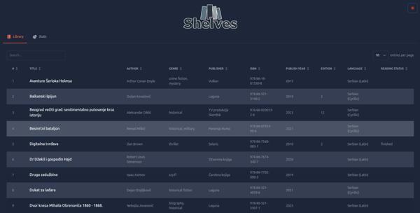

# Shelves 📚

A lightweight SvelteKit app that lets you browse and visualize your book collection. It uses PostgreSQL for data storage (via [Supabase](https://supabase.com/)) and [Flowbite-Svelte](https://flowbite-svelte.com) for UI components and charts.

Please check live demo @ https://shelves-three.vercel.app

## Features

- Server-side data loading from Supabase
- Interactive, paginated, searchable, and sortable table built with `@flowbite-svelte-plugins/datatable`.
- Charts displaying counts by author, publisher, reading status, etc., using `@flowbite-svelte-plugins/chart`
- Light/Dark mode toggle
- Fully responsive layout
