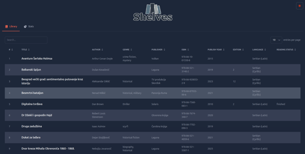

[](https://shelves-three.vercel.app)

# Shelves 📚

A lightweight SvelteKit app that lets you browse and visualize your book collection. It uses PostgreSQL for data storage (via [Supabase](https://supabase.com/)) and [Flowbite-Svelte](https://flowbite-svelte.com) for UI components and charts.

Please check live demo @ https://shelves-three.vercel.app



## Features

- Server-side data loading from Supabase
- Interactive, paginated, searchable, and sortable table built with `@flowbite-svelte-plugins/datatable`.
- Charts displaying counts by author, publisher, reading status, etc., using `@flowbite-svelte-plugins/chart`
- Light/Dark mode toggle
- Fully responsive layout

## Supabase Database Backup

Make sure you have `Docker` installed and running on your machine.

Supabase CLI is required to backup the database. You can install it globally using npm:

```bash
npm i -g supabase
```

Login to your Supabase account:

```bash
supabase login
```

Link remote project:

```bash
supabase link --project-ref <PROJECT-REF>
```

Schema only backup:

```bash
supabase db dump --linked --schema public -f schema.sql
```

Data only backup:

```bash
supabase db dump --linked --data-only -f data.sql
```
